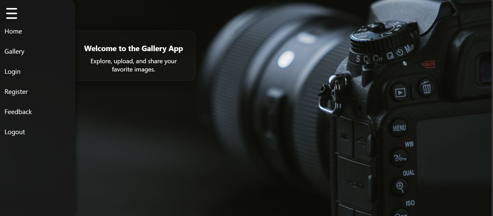

# Gallery View

A simple and modern gallery web application built with the MERN stack (MongoDB, Express, React, Node.js). This project allows users to upload, view, and manage images in an intuitive and responsive interface.

## Features

- Upload and display images in a gallery format
- Responsive design for desktop and mobile
- Backend API for image management
- User-friendly interface
- Organized codebase with clear separation of frontend and backend

## Demo

## Getting Started

### Prerequisites

- [Node.js](https://nodejs.org/) (v14 or higher recommended)
- [npm](https://www.npmjs.com/) or [yarn](https://yarnpkg.com/)
- [MongoDB](https://www.mongodb.com/) (local or cloud instance)

### Installation

1. **Clone the repository:**
git clone https://github.com/subhratagarwal/Gallery-view.git
cd Gallery-view

text

2. **Install backend dependencies:**
cd backend
npm install

text

3. **Install frontend dependencies:**
cd ../frontend
npm install

text

4. **Configure environment variables:**
- Create a `.env` file in the `backend` directory.
- Add your MongoDB URI and any other required environment variables.

Example:
MONGODB_URI=mongodb://localhost:27017/gallery
PORT=5000

text

5. **Start the backend server:**

  a.cd backened 
     
  b.node server.js

text

6. **Start the frontend app:**

     cd ../frontend

      npm start

or  npx http-server -p 8000

## Folder Structure

| Folder      | Description                |
|-------------|---------------------------|
| `/frontend` | React frontend application |
| `/backend`  | Node.js/Express backend   |

## Usage

- Visit `http://localhost:3000` in your browser.
- Use the UI to upload images and view your gallery.

## Contributing

Contributions are welcome! Please open an issue or submit a pull request for improvements or bug fixes.

## License

This project is licensed under the MIT License.

## Acknowledgments

- Built with the MERN stack
- Inspired by modern gallery apps

> _Feel free to customize this README with more details about your project, such as additional features, screenshots, or deployment instructions._
